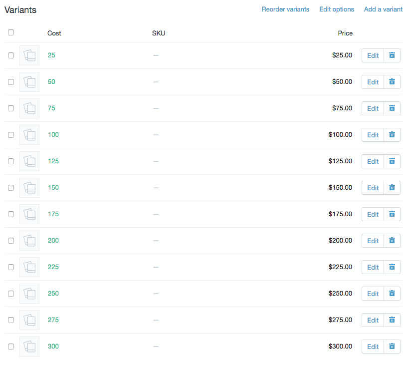

# Shopify-Freight-Shipping
Shopify solution: method to add an additional freight shipping charge to the cart when heavy items are purchased.

This is a method to create sort-of product-specific shipping rates. All this does is add another product to the cart when you purchase a product that needs freight shipping. Sometimes I'll have clients that need to ship heavy things like a longhorn mount or an armoir. If they have carrier-calculated shipping, the calculated prices are over the top. So this let's the shop owner assign an arbitrary additional amount to each overweight item in their shop.

## Steps

1. Upload the freight-shipping.liquid snippet to the product template
2. Add the "Freight Shipping" product to the shop and add it to a collection called "Utility."
  I use the utility collection so that you don't have to loop through hundreds/thousands of products to find the freight shipping product.
  I also add the shop logo as the product image so it looks nicer in the cart.
3. Add the freight shipping cost variants
  Note, the title of each freight shipping cost should match the unformatted dollar value. For example, if the cost is $250.00, the variant title should be 250
  
4. Add the trigger tag to the product that needs shipping in this format: freight-[cost]
  Examples: freight-50, freight-250
  Note: the trigger tag cost must match the variant title exactly